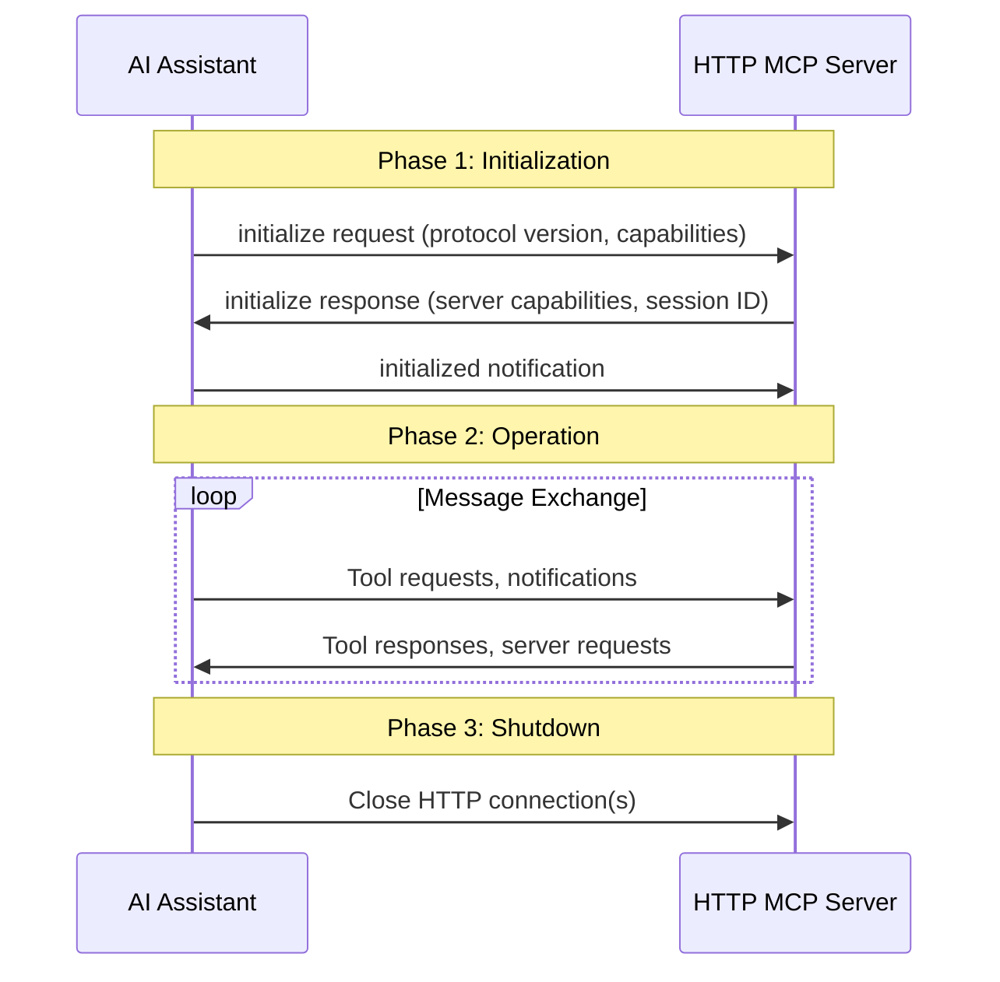
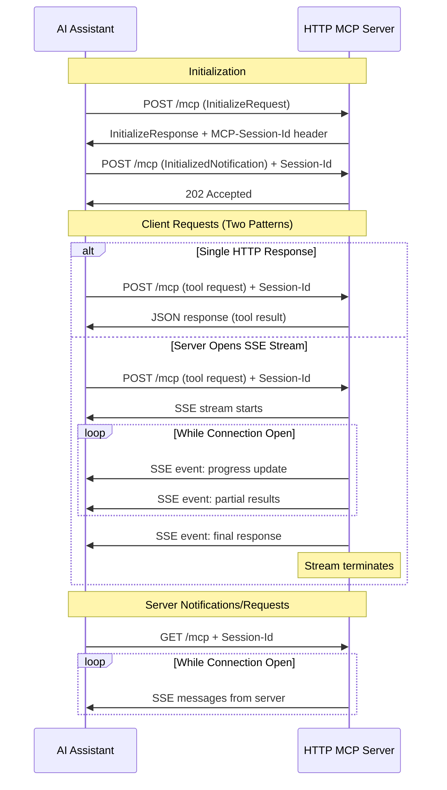

## The AI Security Problem Nobody Talks About

AI assistants fundamentally change how we think about data access security. Traditional APIs serve deterministic requests with predictable outputs. AI assistants, however, synthesize information across multiple sources, cache context in conversation history, and may inadvertently leak sensitive data through generated responses.

When we deployed STDIO MCP servers for local development, security was straightforward: the server inherited the user's desktop credentials, ran in their security context, and accessed only what they could access. But AI security challenges emerged immediately:

**Conversation History Leakage**: AI assistants maintain conversation context. If an assistant retrieves sensitive data in one turn, that context may persist across subsequent queries, even when discussing unrelated topics.

**Cross-Tenant Data Bleed**: Without per-request authentication, STDIO servers grant blanket access. An AI assistant authenticated for one team could theoretically access another team's data if the server doesn't enforce request-level authorization.

**Credential Inheritance Risks**: Desktop credentials include cached tokens, SSH keys, and environment variables. STDIO servers inherit everything, creating an unnecessarily broad attack surface.

HTTP MCP servers with proper authentication architecture solve these problems, but the implementation details matter critically. This is what works in production.

## Security-First Transport Selection

The choice between STDIO and HTTP transport directly impacts your security posture with AI assistants:

**STDIO Security Model:**
- **Credential Scope**: Inherits all user environment credentials (broad access)
- **Authentication**: One-time at process launch (session-based)
- **Audit Trail**: Limited to process lifecycle logs
- **Data Isolation**: Shared memory space with AI assistant process
- **Token Management**: Uses cached desktop credentials (no rotation)

**HTTP Security Model:**
- **Credential Scope**: Bearer token per request (minimal privilege)
- **Authentication**: Every request validated independently (stateless)
- **Audit Trail**: Complete request/response logging with user context
- **Data Isolation**: Network boundary between AI assistant and data
- **Token Management**: Short-lived tokens with automatic rotation

For production AI knowledge systems, HTTP transport provides defense-in-depth that STDIO cannot match. The architectural pattern enforces zero-trust principles: authenticate every request, authorize every action, audit every access.

**Decision Framework:**

Use **STDIO** when:
- Local development with personal knowledge bases
- Single-user desktop workflows
- Trusted environment without sensitive data
- Sub-millisecond latency critical

Use **HTTP** when:
- Shared corporate knowledge bases
- Multi-tenant AI assistant deployments
- Sensitive data requiring access control
- Compliance demands audit trails (SOC 2, ISO 27001, GDPR)
- AI assistants running in untrusted environments

## MCP HTTP Lifecycle and Transport Patterns

**Official MCP Lifecycle** ([Source: MCP Specification](https://modelcontextprotocol.io/specification/2025-11-25/basic/lifecycle))

Every HTTP MCP server follows this three-phase lifecycle. Understanding where security controls apply in each phase is critical:



**Security Enhancement Points:**
- **Phase 1 (Initialization)**: MISE validates OAuth token, establishes session ID, negotiates security capabilities
- **Phase 2 (Operation)**: Every tool request re-validates authentication, checks scopes, logs user context
- **Phase 3 (Shutdown)**: Audit logs finalize, session terminates, tokens invalidated

**HTTP Streamable Transport Pattern** ([Source: MCP Specification](https://modelcontextprotocol.io/specification/2025-11-25/basic/transports))

The official MCP HTTP transport supports both simple POST/response and SSE streaming:



**Security Implications:**

1. **MCP-Session-Id Header**: Cryptographically secure session ID (JWT/UUID) prevents session hijacking. Validated on every request.

2. **SSE Stream Security**: Each SSE event includes user context for audit. If token expires mid-stream, stream terminates gracefully without exposing error details.

3. **Multiple Connection Handling**: Each stream gets unique event IDs. Server never broadcasts same message across streams (prevents cross-user data leakage).

4. **Resumability**: `Last-Event-ID` header allows stream resumption after network failures without replaying events from other users' streams.

**Reference**: [MCP Transports Specification](https://modelcontextprotocol.io/specification/2025-11-25/basic/transports)

## Defense-in-Depth Authentication for AI Assistants

AI assistants introduce authentication challenges that traditional APIs don't face. An AI assistant making dozens of knowledge base queries per minute needs:

**Stateless Token Validation**: Each request must be independently authenticated. Session-based auth (cookies, sticky sessions) fails with distributed AI assistant instances.

**Scope-Based Authorization**: AI assistants should access only the minimum data needed. Blanket "read all" permissions create data leakage risks when assistants synthesize responses.

**Token Expiration Enforcement**: Long-lived tokens cached by AI assistants become security liabilities. Short-lived tokens (15-60 minutes) with automatic rotation prevent credential theft impact.

**Audit Trail with User Context**: When an AI assistant retrieves sensitive data, security teams need to know which human user initiated the request, not just "AI assistant accessed database."

**MCP Authorization Specification**: The [official MCP authorization spec](https://modelcontextprotocol.io/specification/2025-11-25/basic/authorization) defines OAuth 2.1 requirements but leaves implementation details to server builders. This creates security gaps that production servers must address.

### Production-Tested Authentication Architecture

The knowledge-mcp server implements a layered security model:

```
┌─────────────────────────────────────────────────────────┐
│ Layer 1: Network Security (HTTPS, TLS 1.3)              │
├─────────────────────────────────────────────────────────┤
│ Layer 2: OAuth 2.1 Token Validation (Azure AD)          │
│ • Validates JWT signature                               │
│ • Checks token expiration (15-minute window)            │
│ • Verifies issuer and audience                          │
├─────────────────────────────────────────────────────────┤
│ Layer 3: Scope-Based Authorization                      │
│ • Required: knowledge_read (basic search)               │
│ • Optional: knowledge_admin (management functions)      │
├─────────────────────────────────────────────────────────┤
│ Layer 4: Request Validation (JSON-RPC 2.0)              │
│ • Protocol compliance checks                            │
│ • Parameter type validation                             │
│ • Malicious payload detection                           │
├─────────────────────────────────────────────────────────┤
│ Layer 5: Audit Logging (User + Tool + Data Access)      │
│ • User identity (UPN, object ID)                        │
│ • Tool invoked (search_knowledge, get_document)         │
│ • Data accessed (document IDs, query terms)             │
│ • Response metadata (result count, sensitivity level)   │
└─────────────────────────────────────────────────────────┘
```

**Why This Architecture Prevents AI Data Leaks:**

1. **Per-Request Token Validation**: Even if an AI assistant caches a token, it expires within 15 minutes. Stolen tokens have minimal exploitation window.

2. **Scope Isolation**: AI assistants searching documentation (`knowledge_read`) cannot access administrative functions (`knowledge_admin`). Compromised assistants can't escalate privileges.

3. **User Context Preservation**: Audit logs record the human user behind every AI assistant request. Security teams can trace data access back to the initiating user, not just "AI made a request."

4. **No Ambient Authority**: Unlike STDIO servers that inherit desktop credentials, HTTP servers grant zero implicit permissions. Every capability must be explicitly authorized via token scopes.

### Implementation: MISE vs Manual OAuth 2.1

Building OAuth 2.1 validation manually in Python required 400+ lines of code for:
- JWT signature validation
- Token expiration checks  
- Issuer/audience verification
- Refresh token handling
- Conditional access policy enforcement
- Multi-tenant tenant ID validation

Using C# with MISE (Microsoft Identity Service Essentials) reduces this to a single configuration block:

```csharp
services.AddAuthentication(JwtBearerDefaults.AuthenticationScheme)
    .AddMicrosoftIdentityWebApi(configuration.GetSection("AzureAd"));
```

MISE provides:
- **20+ years of security hardening**: Edge cases, attack vectors, and compliance requirements built-in
- **Automatic token validation**: Signature, expiration, issuer, audience checked on every request
- **Conditional access integration**: Device compliance, IP restrictions, MFA enforcement
- **Audit logging**: User context automatically captured and logged
- **Token cache management**: Secure storage, automatic rotation, multi-tenant isolation

For production AI knowledge systems handling sensitive data, the maturity difference matters. Custom OAuth implementations miss edge cases that attackers exploit.

## Protocol Compliance as Security Control

JSON-RPC 2.0 validation isn't just about protocol compliance. It's a critical security boundary preventing malicious payloads from reaching your knowledge base.

**Attack Vectors JSON-RPC Middleware Prevents:**

1. **Parameter Injection**: Malformed parameters attempting SQL injection, command injection, or path traversal
2. **Method Enumeration**: Probing for undocumented methods or internal APIs
3. **Batch Request Amplification**: Sending thousands of requests in a single batch to cause denial-of-service
4. **Type Confusion Attacks**: Sending strings where integers expected to trigger parsing errors and expose stack traces
5. **Oversized Payloads**: Multi-megabyte requests designed to exhaust memory

**Production Validation Pipeline:**

```csharp
public class JsonRpcMiddleware
{
    private readonly IJsonRpcValidationPipeline validationPipeline;
    private readonly ILogger<JsonRpcMiddleware> logger;

    public async Task InvokeAsync(HttpContext context)
    {
        if (context.Request.Path.StartsWithSegments("/mcp"))
        {
            // Enable buffering for multiple reads (validation + handler)
            context.Request.EnableBuffering();
            
            // Validate payload before processing
            var result = await validationPipeline.ValidateAsync(context);
            
            if (!result.IsValid)
            {
                // Return JSON-RPC error, don't expose internal details
                context.Response.ContentType = "application/json";
                await context.Response.WriteAsync(result.JsonRpcError);
                
                // Log for security monitoring
                logger.LogWarning(
                    "JSON-RPC validation failed: {Error}, User: {User}",
                    result.ErrorCode, 
                    context.User.Identity?.Name
                );
                return;
            }
        }
        
        await next(context);
    }
}
```

**Critical Implementation Pattern: Request Buffering**

HTTP request bodies are forward-only streams. Reading them consumes the stream, leaving nothing for downstream handlers. The `EnableBuffering()` call converts the stream to seekable, allowing validation middleware to read it, then reset the position for the MCP handler.

Without buffering:
```
1. Middleware reads body → Stream position = end
2. MCP handler reads body → Gets empty stream → Silent failure
```

With buffering:
```
1. EnableBuffering() → Stream becomes seekable
2. Middleware reads body → Validates
3. Middleware sets Position = 0 → Resets stream
4. MCP handler reads body → Gets full content
```

**Validation Checks Implemented:**

- **JSON Structure**: Valid JSON syntax, no truncated payloads
- **Required Fields**: `jsonrpc: "2.0"`, `method`, `id` present
- **Method Allowlist**: Only registered MCP methods allowed (prevents enumeration)
- **Parameter Types**: Schema validation for each tool's parameters
- **Batch Limits**: Maximum 10 requests per batch (prevents amplification attacks)
- **Payload Size**: 1MB limit (prevents memory exhaustion)

These validations prevent malformed requests from reaching your business logic, reducing attack surface before authentication even occurs.

## Streaming Responses and Data Leak Prevention

Server-Sent Events (SSE) for streaming MCP responses introduces both usability benefits and security considerations that don't exist with traditional request-response patterns.

**Security Challenge: Partial Response Exposure**

With synchronous HTTP responses, either the entire response succeeds (200 OK) or fails (401/403/500). Authentication failures prevent any data transmission. SSE streaming, however, can begin sending data before completing full authorization checks:

```
Scenario: AI assistant queries "show me customer PII data"

1. SSE connection established (200 OK)
2. Start streaming: "Found 1000 customer records..."
3. Mid-stream authorization check: User lacks PII access
4. Connection terminated
5. Result: AI assistant received partial data before termination
```

**Secure Streaming Pattern:**

```csharp
[HttpGet("/mcp/sse")]
public async Task StreamSearchResults(
    string query, 
    CancellationToken cancellationToken)
{
    // CRITICAL: Complete authorization BEFORE starting stream
    var user = HttpContext.User;
    if (!user.HasClaim("scp", "knowledge_read"))
    {
        return Forbid(); // Fails before any data sent
    }
    
    Response.Headers.Add("Content-Type", "text/event-stream");
    Response.Headers.Add("Cache-Control", "no-cache");
    Response.Headers.Add("X-Accel-Buffering", "no"); // Disable proxy buffering
    
    await foreach (var result in knowledgeSearch.StreamResultsAsync(query))
    {
        // Each chunk includes user context for audit
        var eventData = new 
        {
            Type = "search_result",
            Result = result,
            UserId = user.FindFirst("oid")?.Value, // Azure AD object ID
            Timestamp = DateTime.UtcNow
        };
        
        await Response.WriteAsync(
            $"data: {JsonSerializer.Serialize(eventData)}\n\n",
            cancellationToken
        );
        await Response.Body.FlushAsync(cancellationToken);
    }
}
```

**Security Controls for Streaming:**

1. **Pre-Stream Authorization**: Verify all permissions before sending first byte
2. **Per-Chunk Audit Logging**: Log each streamed chunk with user context (not just initial request)
3. **Timeout Enforcement**: Set maximum stream duration (5-10 minutes) to prevent connection exhaustion
4. **Graceful Degradation**: If authorization changes mid-stream (token expires), terminate cleanly without exposing error details
5. **No Buffering Headers**: `X-Accel-Buffering: no` prevents proxies from caching sensitive data

**When Streaming Increases Risk:**

SSE streaming is appropriate for progress updates ("Searching 1000 documents, 25% complete"), but **NOT** for actual data transmission when:
- Data contains PII or confidential information
- User permissions might change during query execution
- Audit requirements demand complete request/response pairs
- Network reliability is poor (partial responses harder to retry)

**When Streaming Reduces Risk:**

Streaming actually improves security for:
- Large result sets (prevents memory exhaustion from buffering full response)
- Long-running queries (provides liveness without keeping full response in memory)
- Real-time feedback (user knows request is processing, reducing duplicate retries)

The knowledge-mcp server uses SSE for progress notifications only, not actual data streaming. Search results return via standard POST responses after complete authorization validation.

## Multi-Tenant Security Isolation

Deploying AI knowledge systems on Azure Container Apps introduces multi-tenant security challenges that require architectural decisions beyond basic authentication.

**Tenant Isolation Attack Vectors:**

1. **Cross-Tenant Query Injection**: AI assistant from Tenant A crafts query attempting to access Tenant B's documents
2. **Shared Cache Poisoning**: Search result cache leaks Tenant A's data to Tenant B
3. **Log Aggregation Exposure**: Centralized logging exposes one tenant's queries to another
4. **Resource Exhaustion**: Tenant A's excessive queries consume resources, degrading Tenant B's service

**Production Security Architecture:**

```
┌──────────────────────────────────────────────────────────┐
│ Azure Container Apps (Ingress + TLS Termination)         │
│ • Per-tenant subdomain: tenantA.knowledge-mcp.io         │
│ • Or path-based: knowledge-mcp.io/tenants/tenantA        │
└──────────────────────────────────────────────────────────┘
         ↓
┌──────────────────────────────────────────────────────────┐
│ Tenant Resolver Middleware                               │
│ • Extracts tenant ID from JWT claims                     │
│ • Validates tenant exists and is active                  │
│ • Rejects requests with invalid/suspended tenants        │
└──────────────────────────────────────────────────────────┘
         ↓
┌──────────────────────────────────────────────────────────┐
│ Tenant Context Injection                                 │
│ • Adds tenant ID to HttpContext.Items                    │
│ • All downstream services inherit tenant context         │
│ • Ensures queries include "tenantId = X" filter          │
└──────────────────────────────────────────────────────────┘
         ↓
┌──────────────────────────────────────────────────────────┐
│ Per-Tenant Data Isolation                                │
│ • Search queries: WHERE tenantId = {context.TenantId}    │
│ • Cache keys: Include tenant ID prefix                   │
│ • Logs: Tenant ID in every structured log entry          │
└──────────────────────────────────────────────────────────┘
```

**Implementation Pattern:**

```csharp
public class TenantResolverMiddleware
{
    public async Task InvokeAsync(HttpContext context)
    {
        // Extract tenant ID from Azure AD token
        var tenantIdClaim = context.User.FindFirst("tid");
        
        if (tenantIdClaim == null)
        {
            context.Response.StatusCode = 401;
            await context.Response.WriteAsync(
                "Missing tenant ID claim in token"
            );
            return;
        }
        
        var tenantId = tenantIdClaim.Value;
        
        // Validate tenant is active (check database or cache)
        var tenant = await tenantService.GetTenantAsync(tenantId);
        
        if (tenant == null || !tenant.IsActive)
        {
            context.Response.StatusCode = 403;
            await context.Response.WriteAsync(
                "Tenant is not active or does not exist"
            );
            return;
        }
        
        // Inject tenant context for downstream services
        context.Items["TenantId"] = tenantId;
        context.Items["TenantContext"] = tenant;
        
        await next(context);
    }
}

// Usage in MCP tool
[McpServerTool]
public async Task<object> SearchKnowledgeAsync(string query)
{
    // CRITICAL: Tenant context automatically injected
    var tenantId = httpContextAccessor.HttpContext
        .Items["TenantId"] as string;
    
    // All queries MUST include tenant filter
    var results = await searchService.SearchAsync(
        query, 
        tenantId, // Prevents cross-tenant access
        maxResults: 10
    );
    
    return results;
}
```

**Tenant Isolation Enforcement:**

- **Database Level**: Row-level security policies filter by tenant ID
- **Search Index Level**: Partition indexes by tenant for performance + isolation  
- **Cache Level**: Key prefix includes tenant ID (`tenant:A:query:hash`)
- **Logging Level**: Every log entry tagged with tenant ID for audit
- **Rate Limiting**: Per-tenant quotas prevent resource monopolization

**Dynamic URL Resolution for Container Apps:**

Azure Container Apps generate environment-specific URLs:
- Dev: `knowledge-mcp-dev.region.azurecontainerapps.io`
- Prod: `knowledge-mcp.region.azurecontainerapps.io`

Hardcoding URLs breaks OAuth redirect URIs. Production pattern:

```csharp
public static string GetServerUrl(
    IConfiguration config, 
    IHostEnvironment env)
{
    // Check explicit configuration first
    var configuredUrl = config["ServerUrl"];
    if (!string.IsNullOrEmpty(configuredUrl))
    {
        return configuredUrl;
    }
    
    // Azure Container Apps set this environment variable
    var containerAppUrl = Environment.GetEnvironmentVariable(
        "CONTAINER_APP_URL"
    );
    if (!string.IsNullOrEmpty(containerAppUrl))
    {
        return containerAppUrl;
    }
    
    // Fallback to localhost for development
    return env.IsDevelopment() 
        ? "http://localhost:8080" 
        : throw new InvalidOperationException(
            "Server URL not configured for production"
        );
}
```

This ensures OAuth redirect URIs work across environments without manual configuration changes.

## Secure Tool Design Patterns

MCP tools are the attack surface where AI assistants interact with your knowledge base. Security patterns at the tool level prevent data exfiltration attempts.

**Tool Security Principles:**

```csharp
[McpServerToolType]
public class SearchKnowledgeTool(
    IKnowledgeSearch knowledgeSearch,
    IHttpContextAccessor httpContextAccessor,
    ILogger<SearchKnowledgeTool> logger)
{
    [McpServerTool(Idempotent = true, ReadOnly = true)]
    [DisplayName("search_knowledge")]
    [Description("Search knowledge base with security controls")]
    public async Task<object> SearchAsync(
        [Description("Search query (max 500 characters)")] string query,
        [Description("Max results (1-20, default 5)")] int maxResults = 5)
    {
        // SECURITY: Parameter validation prevents injection attacks
        if (string.IsNullOrWhiteSpace(query) || query.Length > 500)
        {
            return new { success = false, error = "Invalid query length" };
        }
        
        if (maxResults < 1 || maxResults > 20)
        {
            return new { success = false, error = "Invalid maxResults range" };
        }
        
        // SECURITY: Extract user context for audit logging
        var userId = httpContextAccessor.HttpContext?.User
            .FindFirst("oid")?.Value ?? "unknown";
        var tenantId = httpContextAccessor.HttpContext?.Items["TenantId"] as string;
        
        logger.LogInformation(
            "Tool: search_knowledge invoked | User: {UserId} | Tenant: {TenantId} | Query: {Query}",
            userId, tenantId, query
        );
        
        try
        {
            // SECURITY: Tenant context automatically filters results
            var results = await knowledgeSearch.SearchAsync(
                query, tenantId, maxResults
            );
            
            // SECURITY: Redact sensitive fields before returning
            var sanitizedResults = results.Select(r => new
            {
                Title = r.Title,
                Summary = r.Summary,
                Url = r.Url,
                // OMIT: InternalId, AuthorEmail, RawContent
            });
            
            logger.LogInformation(
                "Tool: search_knowledge completed | Results: {Count}",
                sanitizedResults.Count()
            );
            
            return new 
            { 
                success = true, 
                results = sanitizedResults,
                resultCount = sanitizedResults.Count()
            };
        }
        catch (Exception ex)
        {
            // SECURITY: Log exception details but return generic error
            logger.LogError(ex, "Tool: search_knowledge failed for user {UserId}", userId);
            
            return new 
            { 
                success = false, 
                error = "Search failed. Please contact support."
                // DO NOT return ex.Message (may expose internal details)
            };
        }
    }
}
```

**Tool-Level Security Controls:**

1. **Input Validation**: Always validate query length, result limits, parameter types before processing
2. **User Context Extraction**: Every tool call must log which user (not just which AI assistant) initiated the request
3. **Tenant Context Enforcement**: Tools should never accept tenant ID as a parameter (prevents tenant spoofing). Extract from HttpContext.
4. **Output Sanitization**: Remove internal IDs, author information, system paths before returning results
5. **Generic Error Messages**: Never expose exception details, stack traces, or internal paths to AI assistants
6. **Comprehensive Audit Logging**: Log user, tenant, tool, query, and result count for every invocation

**Why These Patterns Matter for AI Security:**

AI assistants can craft adversarial queries attempting:
- SQL injection via search terms
- Path traversal via document ID parameters
- Tenant spoofing via manipulated context
- Error message mining via malformed inputs

Tool-level validation prevents these attacks before they reach your business logic.

## Security Observability and Audit Compliance

AI assistants accessing corporate knowledge bases create audit requirements that traditional APIs don't face. Security teams need to answer:

- **Who accessed what data?** Not "AI assistant queried database" but "User alice@example.com via AI assistant accessed Customer PII documents"
- **What did they search for?** Query terms may indicate data exfiltration attempts
- **What results were returned?** Document IDs and result counts for compliance audits
- **Were there authorization failures?** Failed access attempts indicate reconnaissance

**Production Audit Logging Architecture:**

```csharp
public class AuditLoggingMiddleware
{
    public async Task InvokeAsync(HttpContext context)
    {
        // Capture request start time
        var startTime = DateTime.UtcNow;
        
        // Extract user and tenant context
        var userId = context.User.FindFirst("oid")?.Value;
        var userPrincipalName = context.User.FindFirst("upn")?.Value;
        var tenantId = context.Items["TenantId"] as string;
        
        try
        {
            await next(context);
            
            // Success: Log complete access details
            logger.LogInformation(
                "MCP Request | User: {UserPrincipalName} ({UserId}) | " +
                "Tenant: {TenantId} | Path: {Path} | Method: {Method} | " +
                "Status: {StatusCode} | Duration: {Duration}ms",
                userPrincipalName, userId, tenantId,
                context.Request.Path, context.Request.Method,
                context.Response.StatusCode,
                (DateTime.UtcNow - startTime).TotalMilliseconds
            );
        }
        catch (Exception ex)
        {
            // Failure: Log with exception details
            logger.LogError(ex,
                "MCP Request Failed | User: {UserPrincipalName} ({UserId}) | " +
                "Tenant: {TenantId} | Path: {Path} | Error: {Error}",
                userPrincipalName, userId, tenantId,
                context.Request.Path, ex.Message
            );
            throw;
        }
    }
}
```

**Structured Logging for Security Analysis:**

All logs emit as structured JSON to STDERR (MCP specification requirement):

```json
{
  "timestamp": "2026-02-04T15:30:00Z",
  "level": "Information",
  "message": "MCP Tool Invoked",
  "properties": {
    "userId": "a1b2c3d4-5678-90ab-cdef-1234567890ab",
    "userPrincipalName": "alice@example.com",
    "tenantId": "tenant-uuid",
    "toolName": "search_knowledge",
    "query": "customer PII data",
    "maxResults": 10,
    "resultCount": 5,
    "documentsAccessed": ["doc-1", "doc-2", "doc-3", "doc-4", "doc-5"],
    "duration": 1234
  }
}
```

**Security Analytics Queries (Kusto/Application Insights):**

```kusto
// Detect potential data exfiltration (excessive result requests)
traces
| where customDimensions.toolName == "search_knowledge"
| where customDimensions.maxResults >= 20
| summarize RequestCount = count() by UserId = tostring(customDimensions.userId), bin(timestamp, 1h)
| where RequestCount > 50
| project timestamp, UserId, RequestCount

// Identify failed authorization attempts (reconnaissance)
traces
| where message contains "Authorization failed" or message contains "Forbidden"
| extend UserId = tostring(customDimensions.userId)
| summarize FailureCount = count() by UserId, bin(timestamp, 5m)
| where FailureCount > 10
| project timestamp, UserId, FailureCount

// Track sensitive keyword searches
traces
| where customDimensions.query contains "PII" or 
        customDimensions.query contains "password" or
        customDimensions.query contains "secret"
| project timestamp, 
          UserId = tostring(customDimensions.userId),
          Query = tostring(customDimensions.query),
          ResultCount = tostring(customDimensions.resultCount)
```

**Compliance Automation:**

Integrate audit logs with compliance platforms:

- **SOC 2 Evidence**: Export monthly access reports for auditors
- **GDPR Requests**: Retrieve all data accessed by specific user
- **Incident Response**: Timeline reconstruction when security events occur
- **Usage Analytics**: Identify over-privileged users or unnecessary data access

## Production Security Hardening Checklist

Beyond authentication and authorization, production HTTP MCP servers require comprehensive security controls:

**1. Security Headers (Prevent Client-Side Attacks)**

```csharp
app.Use(async (context, next) =>
{
    // Prevent MIME type sniffing
    context.Response.Headers.Append("X-Content-Type-Options", "nosniff");
    
    // Prevent clickjacking attacks
    context.Response.Headers.Append("X-Frame-Options", "DENY");
    
    // Control referrer information leakage
    context.Response.Headers.Append("Referrer-Policy", "strict-origin-when-cross-origin");
    
    // Content Security Policy (prevent XSS)
    context.Response.Headers.Append("Content-Security-Policy", 
        "default-src 'self'; script-src 'self'; object-src 'none'");
    
    // HTTPS enforcement in production
    if (!app.Environment.IsDevelopment())
    {
        context.Response.Headers.Append("Strict-Transport-Security", 
            "max-age=31536000; includeSubDomains; preload");
    }
    
    await next();
});
```

**2. Rate Limiting (Prevent Abuse and DoS)**

```csharp
app.UseRateLimiter(new RateLimiterOptions
{
    GlobalLimiter = PartitionedRateLimiter.Create<HttpContext, string>(context =>
    {
        // Rate limit by user ID (prevents single user abuse)
        var userId = context.User.FindFirst("oid")?.Value ?? "anonymous";
        
        return RateLimitPartition.GetTokenBucketLimiter(userId, _ => new()
        {
            TokenLimit = 100,                    // 100 requests
            ReplenishmentPeriod = TimeSpan.FromMinutes(1),
            TokensPerPeriod = 100,
            AutoReplenishment = true
        });
    }),
    RejectionStatusCode = 429
});
```

**3. Request Size Limits (Prevent Memory Exhaustion)**

```csharp
builder.Services.Configure<KestrelServerOptions>(options =>
{
    // Maximum request body size: 1 MB
    options.Limits.MaxRequestBodySize = 1_048_576;
    
    // Maximum concurrent connections
    options.Limits.MaxConcurrentConnections = 1000;
    
    // Request timeout: 60 seconds
    options.Limits.KeepAliveTimeout = TimeSpan.FromSeconds(60);
});
```

**4. CORS Configuration (Prevent Unauthorized Origins)**

```csharp
app.UseCors(policy => policy
    .WithOrigins(
        "https://vscode.dev",
        "https://github.com/copilot",
        "https://your-trusted-client.com"
    )
    .AllowCredentials()
    .WithHeaders("Authorization", "Content-Type")
    .WithMethods("POST", "GET") // Only allow necessary methods
);
```

**5. Secret Management (Never Hardcode Credentials)**

```csharp
// Azure Key Vault integration
builder.Configuration.AddAzureKeyVault(
    new Uri($"https://{keyVaultName}.vault.azure.net/"),
    new DefaultAzureCredential()
);

// Access secrets securely
var connectionString = builder.Configuration["DatabaseConnectionString"];
var apiKey = builder.Configuration["AzureSearchApiKey"];
```

**6. Dependency Security Scanning**

```xml

<PropertyGroup>
  <EnableNETAnalyzers>true</EnableNETAnalyzers>
  <AnalysisMode>All</AnalysisMode>
  <RunAnalyzersDuringBuild>true</RunAnalyzersDuringBuild>
</PropertyGroup>
```

**7. Container Security Hardening**

```dockerfile
# Use minimal base image (reduces attack surface)
FROM mcr.microsoft.com/dotnet/aspnet:8.0-alpine AS base

# Run as non-root user
USER app

# Read-only root filesystem
ENV ASPNETCORE_URLS="http://+:8080"
EXPOSE 8080

# Health check endpoint
HEALTHCHECK --interval=30s --timeout=3s --start-period=5s --retries=3 \
  CMD wget --quiet --tries=1 --spider http://localhost:8080/health/live || exit 1
```

## Architecture Summary: Security-First HTTP MCP

The production architecture that emerged from these security requirements:

```
┌─────────────────────────────────────────────────────────────┐
│ Azure Container Apps                                        │
│ • HTTPS Termination (TLS 1.3)                               │
│ • Auto-scaling (1-10 replicas)                              │
│ • Health-based routing                                      │
└─────────────────────────────────────────────────────────────┘
                           ↓
┌─────────────────────────────────────────────────────────────┐
│ Security Middleware Pipeline                                │
│ ┌─────────────────────────────────────────────────────────┐ │
│ │ 1. Forwarded Headers (preserve client IP)               │ │
│ └─────────────────────────────────────────────────────────┘ │
│ ┌─────────────────────────────────────────────────────────┐ │
│ │ 2. Rate Limiting (100 req/min per user)                 │ │
│ └─────────────────────────────────────────────────────────┘ │
│ ┌─────────────────────────────────────────────────────────┐ │
│ │ 3. Audit Logging (capture user + tenant context)        │ │
│ └─────────────────────────────────────────────────────────┘ │
│ ┌─────────────────────────────────────────────────────────┐ │
│ │ 4. MISE Authentication (OAuth 2.1 token validation)     │ │
│ └─────────────────────────────────────────────────────────┘ │
│ ┌─────────────────────────────────────────────────────────┐ │
│ │ 5. Tenant Resolver (extract + validate tenant)          │ │
│ └─────────────────────────────────────────────────────────┘ │
│ ┌─────────────────────────────────────────────────────────┐ │
│ │ 6. JSON-RPC Validation (protocol compliance)            │ │
│ └─────────────────────────────────────────────────────────┘ │
│ ┌─────────────────────────────────────────────────────────┐ │
│ │ 7. Authorization (scope-based access control)           │ │
│ └─────────────────────────────────────────────────────────┘ │
└─────────────────────────────────────────────────────────────┘
                           ↓
┌─────────────────────────────────────────────────────────────┐
│ MCP Tool Registry                                           │
│ • search_knowledge (with parameter validation)              │
│ • get_search_health (readiness checks)                      │
│ • [Additional tools with security controls]                 │
└─────────────────────────────────────────────────────────────┘
                           ↓
┌─────────────────────────────────────────────────────────────┐
│ Observability Layer                                         │
│ • Application Insights (telemetry)                          │
│ • Structured Logs (JSON to STDERR)                          │
│ • Security Analytics (Kusto queries)                        │
└─────────────────────────────────────────────────────────────┘
```

Every layer enforces security principles: authenticate, authorize, audit, validate.

## Key Takeaways for Production AI Security

Building HTTP MCP servers for enterprise AI assistants requires thinking beyond traditional API security:

**1. Defense-in-Depth is Non-Negotiable**  
Authentication alone is insufficient. Layer MISE OAuth validation, scope-based authorization, JSON-RPC validation, parameter sanitization, and audit logging. Each layer catches attacks the previous layer missed.

**2. Audit Trails Must Capture Human Users, Not Just AI Assistants**  
When security incidents occur, teams need "Alice accessed customer PII," not "AI assistant queried database." Every log entry must include user principal name and Azure AD object ID.

**3. Tenant Isolation Requires Architectural Enforcement**  
Never trust client-provided tenant IDs. Extract from validated JWT claims, inject into HttpContext, and enforce at database query level. Cross-tenant data leakage is the highest-impact risk.

**4. AI Assistants Amplify Attack Surfaces**  
Traditional APIs serve deterministic requests. AI assistants synthesize across sources, cache context, and may leak data through generated responses. Tool-level sanitization prevents internal IDs and system paths from reaching AI context.

**5. Security Observability Enables Compliance**  
SOC 2, ISO 27001, and GDPR audits require proof of access controls. Structured logging with user/tenant/tool/data enables automated compliance evidence generation.

**6. Production Maturity Matters**  
MISE's 20 years of security hardening addresses edge cases (conditional access, device compliance, multi-tenant isolation) that custom OAuth implementations miss. For enterprise knowledge bases, ecosystem maturity reduces risk.

## When These Patterns Apply

This architecture is designed for:
- **Multi-tenant AI knowledge systems** serving hundreds to thousands of users
- **Sensitive data environments** requiring SOC 2, ISO 27001, or GDPR compliance
- **Corporate knowledge bases** accessed by AI assistants (GitHub Copilot, VS Code, custom tools)
- **Zero-trust security models** where every request is independently authenticated and authorized

For local development or personal knowledge bases, STDIO transport may be sufficient. For production enterprise deployments, HTTP with defense-in-depth security is the proven pattern.

The next article provides complete C# implementation code for every component described here: MISE configuration, JSON-RPC middleware, multi-tenant isolation, secure tool design, and Azure Container Apps deployment.

---

## Resources

- **MCP Specification (HTTP Transport)** – Official details for how MCP speaks JSON-RPC 2.0 over HTTP, including initialization, sessions, and streaming.  
    [modelcontextprotocol.io/specification/2025-06-18/basic/transports](https://modelcontextprotocol.io/specification/2025-06-18/basic/transports)
- **MCP Authorization** – The spec section that covers OAuth-based authorization and how clients/servers are expected to enforce it.  
    [modelcontextprotocol.io/specification/2025-06-18/basic/authorization](https://modelcontextprotocol.io/specification/2025-06-18/basic/authorization)
- **JSON-RPC 2.0 Specification** – The base protocol this article leans on for error handling, batching, and message structure.  
    [jsonrpc.org/specification](https://www.jsonrpc.org/specification)
- **OAuth 2.0 (RFC 6749)** – The core authorization framework behind the bearer tokens and scopes discussed here.  
    [datatracker.ietf.org/doc/html/rfc6749](https://datatracker.ietf.org/doc/html/rfc6749)
- **C# SDK for MCP** – Strongly typed .NET SDK with attributes and helpers used in the HTTP server examples.  
    [github.com/modelcontextprotocol/csharp-sdk](https://github.com/modelcontextprotocol/csharp-sdk)
- **Azure Container Apps Documentation** – Reference for the deployment and scaling model used in the architecture diagrams.  
    [learn.microsoft.com/azure/container-apps](https://learn.microsoft.com/azure/container-apps)

**Related Reading:**
- Building Your First HTTP MCP Server (Implementation Guide)
- Securing AI Knowledge Access: STDIO MCP Server Patterns