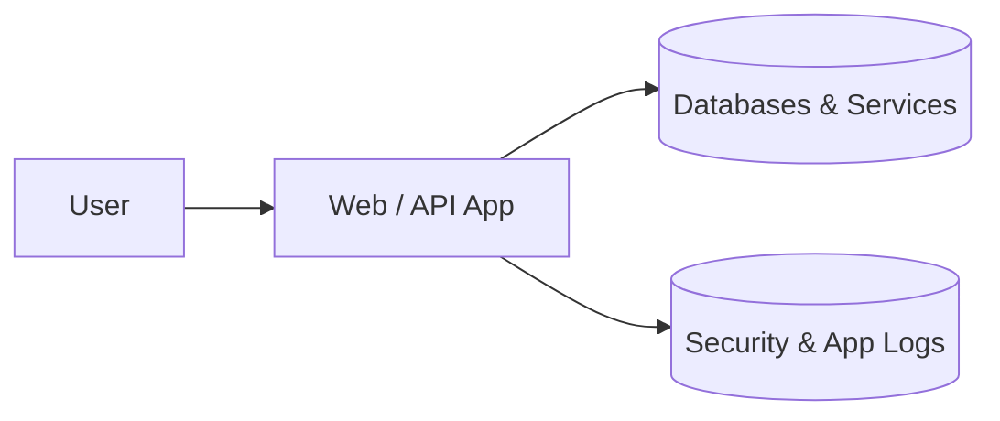
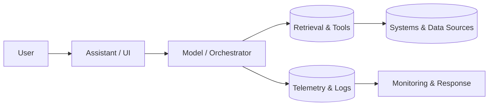

## Why This Post

By the end of 2025, "add AI" stopped being a differentiator and started being table stakes. What *hasn’t* kept up is how seriously most teams treat AI security.

I keep seeing the same pattern:

- Ship a proof‑of‑concept with an LLM or agent.
- Wrap it with traditional application security (HTTPS, auth, basic logging).
- Assume that’s "secure enough".

Meanwhile, governments, standards bodies, and attackers are treating AI as a brand‑new attack surface. This post is a snapshot as of **20 December 2025** of what we already know:

- Why "AI needs security" isn’t theoretical anymore.
- What official guidance actually says.
- Concrete incidents that have already gone wrong.
- A practical mental model for securing AI systems going forward.

---

## From Neat Demo to Attack Surface

Traditional software has a relatively clear security boundary: inputs, processing, outputs. AI systems break that in three ways:

1. **They learn from data** – If an attacker can influence your training or retrieval data, they can shape model behavior (data poisoning, retrieval poisoning).
2. **They behave probabilistically** – The same input doesn’t always yield the same output, which makes testing and monitoring harder.
3. **They reason over instructions** – "Prompt injection" and tool misuse are attacks on the model’s goal‑selection, not on your HTTP endpoints.

When you wire AI into real systems (codebases, ticketing, payments, operations), this isn’t academic. It becomes an operational risk.

---

## Governments and Standards Bodies Are Noticing

Several agencies and standards groups have already published concrete AI security guidance:

- **NSA / CISA / Five Eyes** have published detailed guidance on:
  - Securing the **data supply chain** used to train and operate AI.
  - Defending against **adversarial threats** like model poisoning and prompt injection.
  - Applying "**secure by design**" principles through the AI lifecycle, not just at deployment.

- The **UK National Cyber Security Centre (NCSC)** is leading work on AI cyber security codes of practice that are now feeding into ISO/IEC standards. A good starting point is their guidance on [Guidelines for secure AI system development](https://www.ncsc.gov.uk/collection/guidelines-secure-ai-system-development).

- The **NIST AI Risk Management Framework (AI RMF)** is becoming the de‑facto reference for AI governance and risk, even outside the U.S. The official framework and playbook are available at [nist.gov/itl/ai-risk-management-framework](https://www.nist.gov/itl/ai-risk-management-framework).

- **OWASPs LLM Security Top 10** has made it very clear that LLMs introduce new classes of vulnerabilities (prompt injection, data exfiltration, insecure plugin/tool usage) that dont fit neatly into traditional web app threat models. See the project page at [owasp.org/www-project-top-10-for-large-language-model-applications](https://owasp.org/www-project-top-10-for-large-language-model-applications/).

- Standards like **ISO/IEC 42001** (AI management systems) are starting to do for AI what ISO 27001 did for cybersecurity: turn "best practice" into auditable expectations. An overview is available from the official standards body at [iso.org](https://www.iso.org/standard/82112.html).

The theme across all of these: **AI security is not separate from cyber security, but it has its own failure modes.**

---

## Real Incidents: Where AI Security Has Already Failed

You don’t have to speculate about what could go wrong. We already have enough real‑world incidents to see the pattern.

### 1. Sensitive Data Leaked into Public Models

In 2023 and 2024, multiple organizations had incidents where employees pasted:

- proprietary source code,
- internal incident reports,
- or confidential meeting notes

directly into public chatbots to "get help quickly". Those prompts became part of training or evaluation data, or at minimum were stored in third‑party logs. Some of these cases were high‑profile enough that companies had to ban staff‑wide use of external AI tools.

**Lesson:** if the model isn’t running in your controlled environment with contractual guarantees, assume anything you send is out of your control.

### 2. Token and Secret Exposure Through Logs

Several early LLM integrations logged **raw prompts and tool inputs** for debugging. Those logs quietly collected:

- OAuth tokens,
- internal URLs and IPs,
- customer identifiers.

In a few cases, those logs ended up in centralized logging platforms with broader access than the production system itself. The AI layer accidentally became the easiest way to exfiltrate secrets.

**Lesson:** AI observability is necessary, but logging has to be treated as a sensitivity upgrade, not a free‑for‑all.

### 3. Deepfake Fraud and Social Engineering

By 2024–2025, deepfake voice and video scams moved from "research demo" to **real financial fraud**:

- Attackers synthesized voices of executives and used them to authorize wire transfers.
- Video deepfakes were used in social engineering campaigns against customers and employees.
- Political deepfakes targeted reputations and public opinion at scale.

Detection technology exists, but the economics favor attackers: once you can synthesize one convincing deepfake, you can generate thousands.

**Lesson:** AI makes traditional social engineering and fraud cheaper, faster, and more scalable.

### 4. AI‑Assisted Malware and Evasion

Security researchers have repeatedly shown that:

- Generative models can assist in creating polymorphic malware fragments.
- AI can help generate evasive payloads that adapt to static signatures.
- Models fine‑tuned without guardrails can be steered into producing detailed exploit chains.

Even when mainstream providers implement safety filters, **open‑source models without guardrails** are easy to download and adapt.

**Lesson:** you can’t rely on "our vendor blocks bad prompts" as your primary defense. Assume attackers have access to powerful, unfiltered models.

### 5. Vulnerable Code From "Helpful" AI Assistants

Multiple empirical studies through 2024–2025 have shown:

- AI‑generated code often compiles and passes simple tests.
- That same code **frequently contains security vulnerabilities**:
  - missing input validation,
  - insecure crypto,
  - hard‑coded secrets,
  - incorrect authorization checks.

Unless teams explicitly run secure code review and automated scanning over AI‑written code, they quietly ship new vulnerabilities faster than before.

**Lesson:** AI accelerates both *good* and *bad* code. Without security checks, it just moves you faster in an unknown direction.

---

## Structural Gaps: Why Traditional Security Isn’t Enough

Across these incidents, a few systemic gaps show up again and again.

### 1. Treating Models Like "Just Another API"

Teams secure the HTTP endpoint and stop there:

- TLS, auth, some rate limiting.
- Maybe WAF rules.

What’s missing:

- Threat models for **prompt injection** and tool misuse.
- Controls around **what data the model can see** at query time.
- Differentiation between **trusted** and **untrusted** instructions.

### 2. Ignoring the Data and Model Supply Chain

Most organizations still do not have:

- A clear inventory of **which datasets** were used to train or fine‑tune which models.
- Provenance for where that data came from and how it was validated.
- Controls against **training‑time poisoning** or retrieval‑time manipulation.

If you wouldn’t deploy an unvetted binary into production, you shouldn’t treat opaque model weights or shadow datasets as safe by default either.

### 3. Fragmented Governance

Security, compliance, ML engineering, and product often each own a *piece* of AI:

- ML teams own the model.
- Security owns the perimeter.
- Legal owns policies.
- Product owns features.

Without a unified AI risk view, nobody is accountable for cross‑cutting risks like "can this assistant leak confidential data in a future conversation?"

---

## Why AI Security Is Hard in the Real World

Even with good intentions and standard guidance, AI security turns out to be hard for a few structural reasons:

- **Non‑deterministic behavior** – the same input can produce different outputs, which makes regression testing and "known good" behavior less clear.
- **Dynamic instructions** – the most important part of the system (the prompt and tools description) often lives in configuration, not code, and changes quickly.
- **Blurry trust boundaries** – models, tools, data stores, and third‑party APIs all participate in a single conversation, but are owned by different teams or vendors.
- **Data gravity** – once data flows into prompts, logs, embeddings, and fine‑tuning sets, it is hard to cleanly remove or retroactively redact.
- **Lack of mature telemetry** – many AI stacks still log too little or too much, either missing signals or leaking sensitive content into observability systems.

Within that reality, there are a few **high‑stakes scenarios** where security and validation are absolutely non‑negotiable:

1. **Agentic systems with tool access** – assistants that can open tickets, modify infrastructure, change configs, or trigger workflows. Every tool call must be policy‑checked, rate‑limited, and auditable.
2. **Retrieval over sensitive knowledge** – systems that ground answers on customer records, incidents, contracts, or regulated data. You need strong access control at the retrieval layer, not just at the UI.
3. **Code generation wired to build/deploy** – copilots or agents that can create PRs, modify pipelines, or touch infrastructure‑as‑code. AI‑written changes must pass the same secure review and scanning as human changes.
4. **Multi‑tenant assistants and SaaS copilots** – shared backends serving many customers. Fine‑grained isolation and cross‑tenant leak prevention at the tool and retrieval layers are mandatory.
5. **Operational technology and safety‑critical systems** – AI used in monitoring, recommendation, or control loops for industrial, healthcare, or critical infrastructure environments. Here, safety analysis, fallback behavior, and human‑in‑the‑loop design are as important as traditional security controls.

These are the places where "it mostly works" is not good enough. You need explicit design, threat modeling, and validation, not just optimistic assumptions.

---

## From Classic App Security to Unknown Territory

Most security teams grew up in a world where the mental model looked like this:

You secure the app perimeter (auth, TLS, input validation), harden the data stores, and protect the logs.

AI‑integrated systems add new paths and feedback loops:

New questions appear:

- Can untrusted prompts change what the model *believes* its goal is?
- Can tool output or retrieved context be used to exfiltrate data in later turns?
- Are logs and traces now more sensitive than the original databases?
- Who owns the risk when the model calls a tool that calls another system?

We are still early in mapping this territory. The guidance from NSA, NCSC, NIST, OWASP, and others gives us solid guardrails, but real‑world deployments keep revealing new edge cases and misuse patterns.

Treat today’s patterns as **minimum baselines**, not finished recipes. The safest organizations assume that:

- new attack techniques will appear,
- models will behave unexpectedly at the edges,
- and previously "safe" configurations may need revisiting as capabilities grow.

## What "Good" AI Security Looks Like (End of 2025 View)

Taking guidance from NSA/NCSC, NIST, OWASP, SANS, CSA, and recent academic work, a practical stack for AI security as of late 2025 looks roughly like this:

### 1. Governance and Risk Management

- Treat AI systems as **critical systems with their own risk register**.
- Use something like **NIST AI RMF** as the backbone:
  - Define AI use cases and impacts.
  - Identify risks (misuse, leakage, bias, operational failures).
  - Map them to controls and owners.

### 2. Data and Model Supply Chain Security

- Maintain a **bill of materials** for:
  - training datasets,
  - fine‑tuning data,
  - external retrieval sources,
  - model versions and providers.
- Apply controls similar to software supply chain security:
  - integrity checks,
  - provenance,
  - access control,
  - periodic review for poisoned or inappropriate data.

### 3. Model and Application Security

- Adopt **LLM‑specific threat modeling**:
  - prompt injection and jailbreaking,
  - cross‑tenant data leaks via tools or retrieval,
  - unsafe tool invocation and autonomous actions.
- Use patterns from **OWASP LLM Top 10**:
  - strict separation of **user input** vs **system instructions**,
  - output filters and policy checks before execution,
  - guardrails over what tools the model can call.

### 4. Lifecycle Security (Build → Deploy → Operate)

- Secure‑by‑design:
  - treat safety and security requirements as first‑class in design reviews.
- Deployment:
  - run sensitive models in **isolated, monitored environments**, 
  - keep secrets out of prompts and logs.
- Operations:
  - monitor for **abuse patterns**: unusual query volumes, exfil patterns, repeated jailbreak attempts,
  - log enough for forensic analysis *without* creating a second data leak via logs.

### 5. Human‑Centric Controls

- Train developers and operators on **AI‑specific risks**:
  - why copying secrets into a chatbot isn’t harmless,
  - how prompt injection actually works,
  - what safe code review for AI‑generated code looks like.
- Define **acceptable use policies** for employees and customers around AI tools.

---

## Where to Go Deeper

If you want to invest in this space, there are some good starting points:

- For **governance**: NIST AI Risk Management Framework + ISO/IEC 42001 drafts.
- For **technical threats**: OWASP LLM Security Top 10 and emerging SANS AI security guidance.
- For **broader mapping**: recent academic work that compares AI governance frameworks and proposes unified taxonomies for AI security and safety controls.

None of these are "done". The ecosystem is changing quickly. But the direction is clear:

> AI security isn’t about making models perfect. It’s about treating them as powerful, failure‑prone components inside a system you *do* control.

If your AI story in 2026 doesn’t have a security story attached, you don’t have an AI strategy yet—you have a demo.
